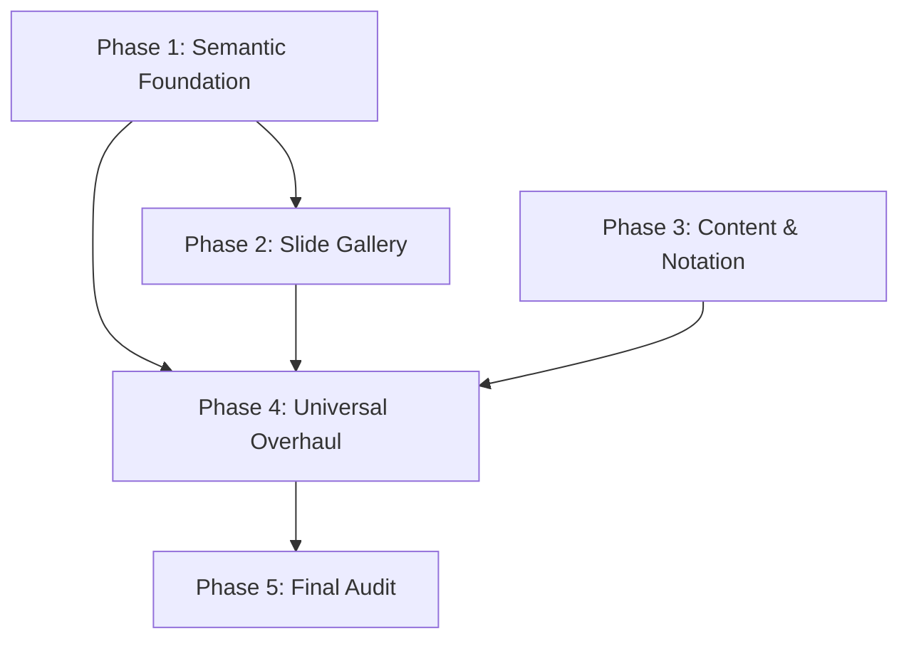

# Implementation Plan: Fidelity & Flow Upgrade

## 1. Plan Overview
This plan targets the technical debt in our 'Premium' standard. We will fix the rendering regressions in Lec 09/11, overhaul the Slide Viewer, and perform a global hand-tuned visual cleanup.

## 2. Dependency Graph

## 3. Execution Strategy Table

| Stage | Phases | Mode | Agent(s) |
|-------|--------|------|----------|
| 1: Foundation | 1 | Sequential | `design_system_engineer` |
| 2: UI Redesign | 2 | Sequential | `ux_designer` |
| 3: Content | 3 | Sequential | `coder` |
| 4: Overhaul | 4 | Sequential | `coder` |
| 5: Quality | 5 | Sequential | `code_reviewer` |

## 4. Phase Details

### Phase 1: Semantic Foundation & Recovery
- **Objective**: Restore Lec 09/11 and define the visual standard.
- **Agent**: `design_system_engineer`
- **Files to Modify**:
  - `src/styles/design-system.css`: Define `--node-primary`, `--node-highlight`, `--link-default`, etc.
  - `src/pages/lectures/Lec09.jsx` & `Lec11.jsx`: Fix rendering logic/imports.
- **Validation**: Verify Lec 09 and 11 are no longer blank.

### Phase 2: Slide Gallery Redesign
- **Objective**: Replace the horizontal slider with a vertical skimmable gallery.
- **Agent**: `ux_designer`
- **Files to Modify**:
  - `src/components/ui/Premium/LectureSlideViewer.jsx`: Rebuild as vertical list.
  - `src/components/ui/Premium/LectureSlideViewer.module.css`: Styles for skimmable cards.
- **Validation**: Verify smooth vertical scrolling and lazy-loading of slides.

### Phase 3: Pedagogical Accuracy Pass
- **Objective**: Move Assignment Problem and convert notation to LaTeX symbols.
- **Agent**: `coder`
- **Files to Modify**:
  - `src/pages/lectures/Lec02.jsx`: Global replace of 'Theta/Omega' text.
  - `src/pages/lectures/Lec04.jsx`: Add Assignment Problem (Exhaustive search $n!$).
  - `src/pages/lectures/Lec05.jsx`: Remove duplicate Assignment Problem.
- **Validation**: Verify symbols $\Theta, \Omega$ are crisp; verify Assignment Problem placement.

### Phase 4: Universal Hand-Tuned Overhaul
- **Objective**: Global visual audit and spacing fix for all 11 lectures.
- **Agent**: `coder`
- **Files to Modify**:
  - All 11 Lecture JSX files: Walk through every diagram and tracer. Adjust padding, margin, and colors using the new semantic palette.
  - `src/components/visualization/bespoke/Bespoke.module.css`: Add spacing utility classes.
- **Validation**: No 'cramped' or 'ugly' visuals remaining in any lecture.

### Phase 5: Final Fidelity Audit
- **Objective**: Global quality gate.
- **Agent**: `code_reviewer`
- **Validation**: Direct cross-reference against approved Design Document and Success Criteria.

## 5. File Inventory

| Action | Path | Phase | Purpose |
|--------|------|-------|---------|
| Modify | `src/styles/design-system.css` | 1 | Semantic coloring |
| Modify | `src/components/ui/Premium/LectureSlideViewer.jsx` | 2 | Better browsing experience |
| Modify | `src/pages/lectures/Lec04.jsx` | 3 | Content accuracy |
| Modify | All Lectures | 4 | Visual perfection |

## 6. Risk Classification
- Phase 1: LOW (CSS/Imports)
- Phase 2: MEDIUM (UI State)
- Phase 3: MEDIUM (Syntax errors in LaTeX)
- Phase 4: HIGH (Massive file touch count; delicate layout balancing)

## 7. Execution Profile
- Strictly sequential for maximum precision.
- Estimated wall time: 12-15 turns.
