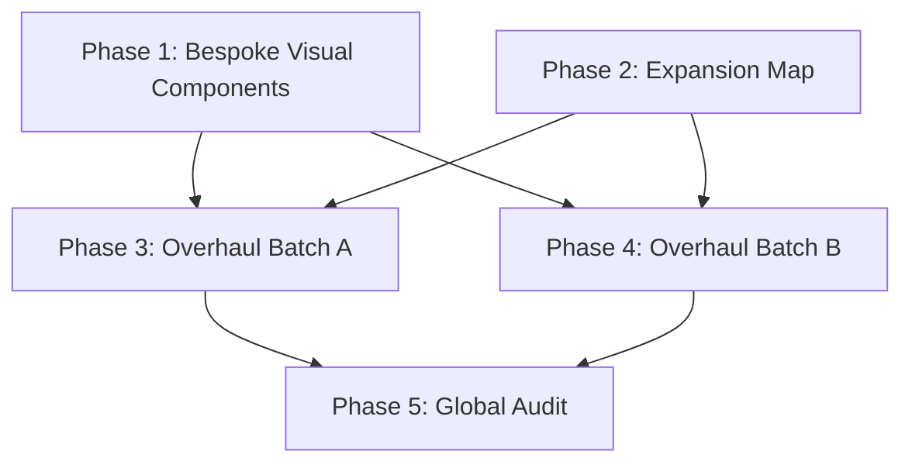

# Implementation Plan: Premium Lecture Overhaul

## 1. Plan Overview
This plan details the systematic overhaul of the 11 lecture pages to achieve full narrative and visual parity with the source PPTX files. We utilize a Foundation-first strategy followed by parallelized implementation batches.

## 2. Dependency Graph

## 3. Execution Strategy Table

| Stage | Phases | Mode | Agent(s) |
|-------|--------|------|----------|
| 1: Foundation | 1 | Sequential | `design_system_engineer` |
| 2: Mapping | 2 | Sequential | `ux_designer` |
| 3: Overhaul | 3, 4 | Parallel | `coder` (x2) |
| 4: Quality | 5 | Sequential | `code_reviewer` |

## 4. Phase Details

### Phase 1: Bespoke Visual Components
- **Objective**: Create the PremiumImage and Lightbox foundation.
- **Agent**: `design_system_engineer`
- **Files to Create**:
  - `src/components/ui/Premium/PremiumImage.jsx`: Component with `src`, `alt`, `caption`, and click-to-zoom logic.
  - `src/components/ui/Premium/PremiumImage.module.css`: Styles for figures, captions, and hover states.
  - `src/components/ui/Premium/LightboxPortal.jsx`: portal component with backdrop-blur and zoom controls.
- **Validation**: Verify modal mounting/unmounting and responsive image scaling.

### Phase 2: Narrative Expansion Map
- **Objective**: Audit JSON ground truth and map to target JSX sections.
- **Agent**: `ux_designer`
- **Files to Create**:
  - `docs/overhaul-expansion-map.md`: Markdown document listing every missing section/image per lecture.
- **Validation**: Direct cross-reference against `src/data/lectures/*.json`.

### Phase 3: Overhaul Batch A (Lec 01-07)
- **Objective**: Implement parity for the first half of the curriculum.
- **Agent**: `coder`
- **Files to Modify**:
  - `src/pages/lectures/Lec01.jsx` to `Lec07.jsx`
- **Validation**: `npm run lint` + verify all sections from the Expansion Map are present.
- **Dependencies**: blocked_by: [1, 2]

### Phase 4: Overhaul Batch B (Lec 09-13)
- **Objective**: Implement parity for the second half of the curriculum.
- **Agent**: `coder`
- **Files to Modify**:
  - `src/pages/lectures/Lec09.jsx` to `Lec13.jsx`
- **Validation**: `npm run lint` + verify all sections from the Expansion Map are present.
- **Dependencies**: blocked_by: [1, 2]

### Phase 5: Global Premium Audit
- **Objective**: Final quality and accessibility pass.
- **Agent**: `code_reviewer`
- **Validation**: Manual check of "Narrative Mirroring" for all 35+ integrated images.
- **Dependencies**: blocked_by: [3, 4]

## 5. File Inventory

| Action | Path | Phase | Purpose |
|--------|------|-------|---------|
| Create | `src/components/ui/Premium/PremiumImage.jsx` | 1 | Visual host for PPTX assets |
| Create | `src/components/ui/Premium/LightboxPortal.jsx` | 1 | Detailed inspection interface |
| Create | `docs/overhaul-expansion-map.md` | 2 | Implementation guide |
| Modify | `src/pages/lectures/LecXX.jsx` | 3/4 | Content expansion |

## 6. Risk Classification

| Phase | Risk | Rationale |
|-------|------|-----------|
| 1 | LOW | Standard React Portal implementation. |
| 2 | MEDIUM | Requires careful synthesis of PPTX content. |
| 3 | HIGH | Large file modifications; potential for layout breaks. |
| 4 | HIGH | Large file modifications; Lec 13 is asset-heavy. |
| 5 | MEDIUM | Subjective quality audit. |

## 7. Execution Profile
- Total phases: 5
- Parallelizable phases: 2 (Phases 3 and 4)
- Sequential-only phases: 3
- Estimated parallel wall time: 4-5 turns
- Estimated sequential wall time: 8-10 turns
