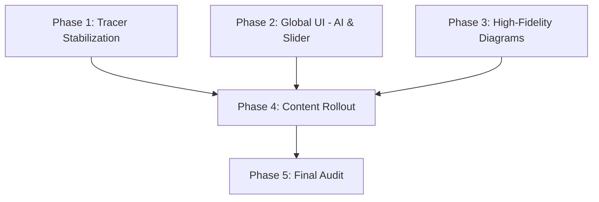

# Implementation Plan: UX & Content Stability Upgrade

## 1. Plan Overview
This plan focuses on immediate visual stabilization (fixing broken tracers), followed by architectural UI updates (Global AI button, Home Page Slider), and concluding with a massive content enrichment pass across all course algorithms.

## 2. Dependency Graph

## 3. Execution Strategy Table

| Stage | Phases | Mode | Agent(s) |
|-------|--------|------|----------|
| 1: Foundation | 1, 2 | Sequential | `debugger`, `design_system_engineer` |
| 2: Fidelity | 3 | Sequential | `ux_designer` |
| 3: Rollout | 4 | Sequential | `coder` |
| 4: Quality | 5 | Sequential | `code_reviewer` |

## 4. Phase Details

### Phase 1: Tracer Stabilization
- **Objective**: Fix missing CSS classes and logic in bespoke visualizers.
- **Agent**: `debugger`
- **Files to Create**:
  - `src/components/visualization/bespoke/SharedTracers.module.css`: Common styles for array elements, bars, and highlights.
- **Files to Modify**:
  - `src/components/visualization/bespoke/QuickSortTracer.jsx`: Fix step logic and import shared styles.
  - `src/components/visualization/bespoke/Bespoke.module.css`: Cleanup and use shared primitives.
- **Validation**: Highlighting and animations verified in Quick Sort.

### Phase 2: Global UI (AI FAB & Slider)
- **Objective**: Implement global assistance and improved landing navigation.
- **Agent**: `design_system_engineer`
- **Files to Create**:
  - `src/components/layout/CircularAIFab.jsx`: Floating button component.
  - `src/components/ui/Home/LectureSlider.jsx`: CSS Snap-based carousel.
- **Files to Modify**:
  - `src/components/layout/MainLayout.jsx`: Inject AI FAB.
  - `src/pages/HomePage.jsx`: Replace/augment grid with Slider.
- **Validation**: Verify FAB persistence and carousel snap-points.

### Phase 3: High-Fidelity Diagram Library
- **Objective**: Replace corrupted screenshots with native React/SVG diagrams.
- **Agent**: `ux_designer`
- **Files to Create**:
  - `src/components/visualization/diagrams/AVLRotationDiagram.jsx`: Clean SVG visual for tree rotations.
- **Files to Modify**:
  - `src/pages/lectures/Lec10.jsx`: Replace blurry images with new components.
- **Validation**: Verify technical accuracy of rotation steps.

### Phase 4: Content Enrichment (Algorithm Cards)
- **Objective**: Rollout standardized algorithm explanations course-wide.
- **Agent**: `coder`
- **Files to Create**:
  - `src/components/ui/Premium/AlgorithmCard.jsx`: Standard container for Goal, Steps, and Complexity Stats.
- **Files to Modify**:
  - All 11 Lecture JSX files: Integrate AlgorithmCard and expand text depth.
- **Validation**: Each algorithm has clear numbered steps and a complexity stats bar.

### Phase 5: Final Fidelity Audit
- **Objective**: Global pass for accuracy and visual polish.
- **Agent**: `code_reviewer`
- **Validation**: Cross-verify every enriched algorithm against Dr. Moheeb's original slides.

## 5. File Inventory

| Action | Path | Phase | Purpose |
|--------|------|-------|---------|
| Create | `src/components/visualization/bespoke/SharedTracers.module.css` | 1 | CSS stabilization |
| Create | `src/components/layout/CircularAIFab.jsx` | 2 | Global Assistance |
| Create | `src/components/ui/Home/LectureSlider.jsx` | 2 | Home page navigation |
| Create | `src/components/visualization/diagrams/AVLRotationDiagram.jsx` | 3 | Asset fidelity |
| Create | `src/components/ui/Premium/AlgorithmCard.jsx` | 4 | Content standardization |
| Modify | All Lectures | 4 | Technical enrichment |

## 6. Risk Classification
- Phase 1: MEDIUM (Logic fixes)
- Phase 2: LOW (UI Layout)
- Phase 3: MEDIUM (SVG precision)
- Phase 4: HIGH (Massive file touch count; potential for build errors)

## 7. Execution Profile
- Total phases: 5
- Parallelizable phases: 0 (Plan is strictly sequential to maintain precision)
- Estimated sequential wall time: 10-12 turns
